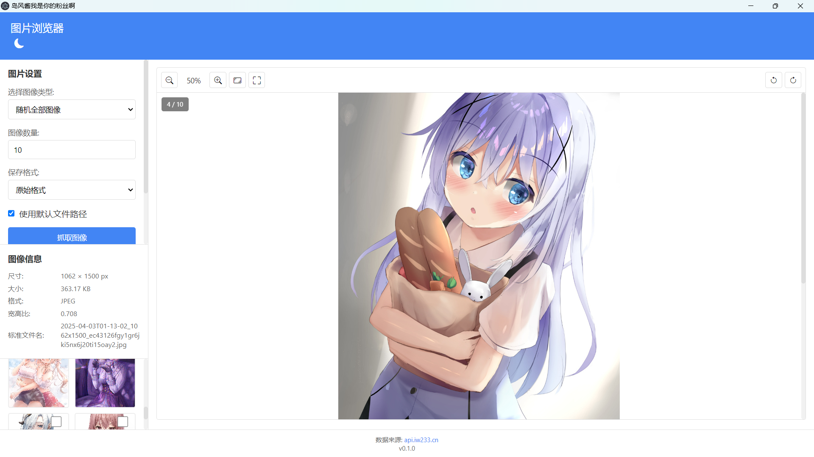
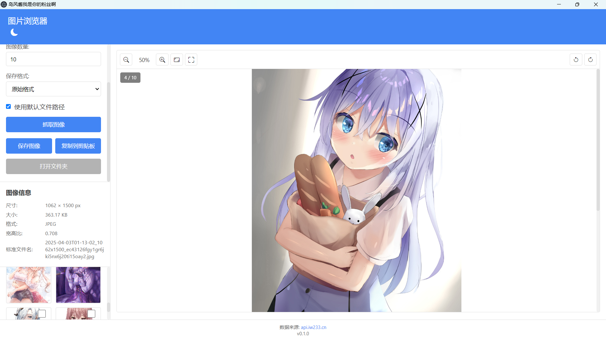

# 二次元图片下载器

这是我的最早的一个开源项目，所以我想间或维持其更新。

---


一个专注于二次元图片的现代化下载浏览器。




## 🌟 特色功能

- 📸 多种二次元图片分类
  - 精选图像
  - 随机无色图像
  - 银发
  - 兽耳
  - 星空
  - 竖屏/横屏
- 🎨 强大的图片浏览功能
  - 缩放、旋转
  - 适应窗口/原始大小切换
  - 拖拽浏览
  - 左右快捷导航
- 💾 便捷的保存功能
  - 一键保存
  - 批量下载
  - 多种保存格式（原始/JPG/PNG）
  - 智能文件名生成
- 🌓 舒适的浏览体验
  - 日间/夜间主题切换
  - 图像信息展示
  - 缩略图预览
  - 复制到剪贴板

## ⌨️ 快捷键

| 快捷键         | 功能          |
| -------------- | ------------- |
| `Ctrl + +/-` | 放大/缩小图片 |
| `Ctrl + 0`   | 重置缩放      |
| `F`          | 适应窗口      |
| `R/L`        | 向右/左旋转   |
| `←/→`      | 上一张/下一张 |
| `Ctrl + S`   | 保存当前图片  |
| `Ctrl + C`   | 复制到剪贴板  |
| `Ctrl + A`   | 全选/取消全选 |

## 🖼️ 数据来源

本程序的图片数据由 [api.cnmiw.com](https://api.cnmiw.com) 提供支持。

## 📦 发布新版本

1. 更新 package.json 中的版本号(***** 每次都要忘记！！！ )
2. 提交并推送代码
3. 创建新标签：

```bash
git tag -a vX.X.X -m "版本说明"
```

4. 推送标签：

```bash
git push origin vX.X.X
```

5. 等待 GitHub Actions 自动构建并发布
